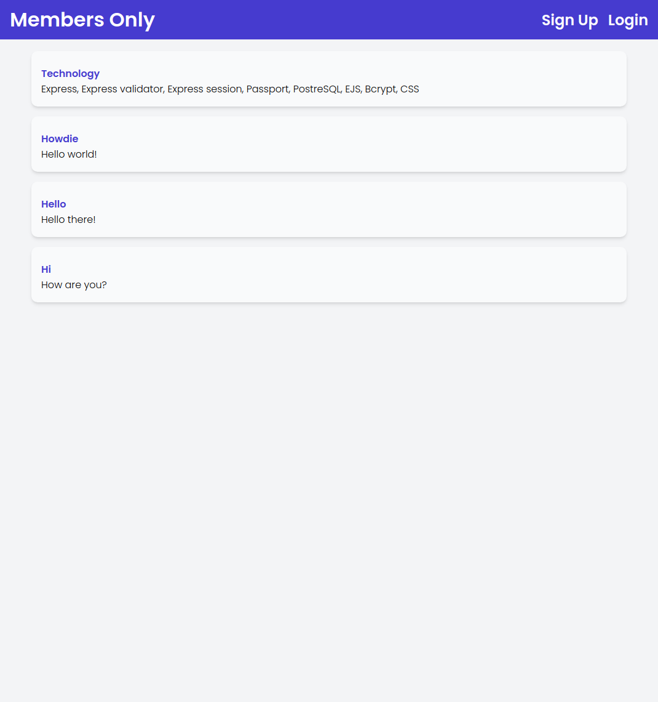
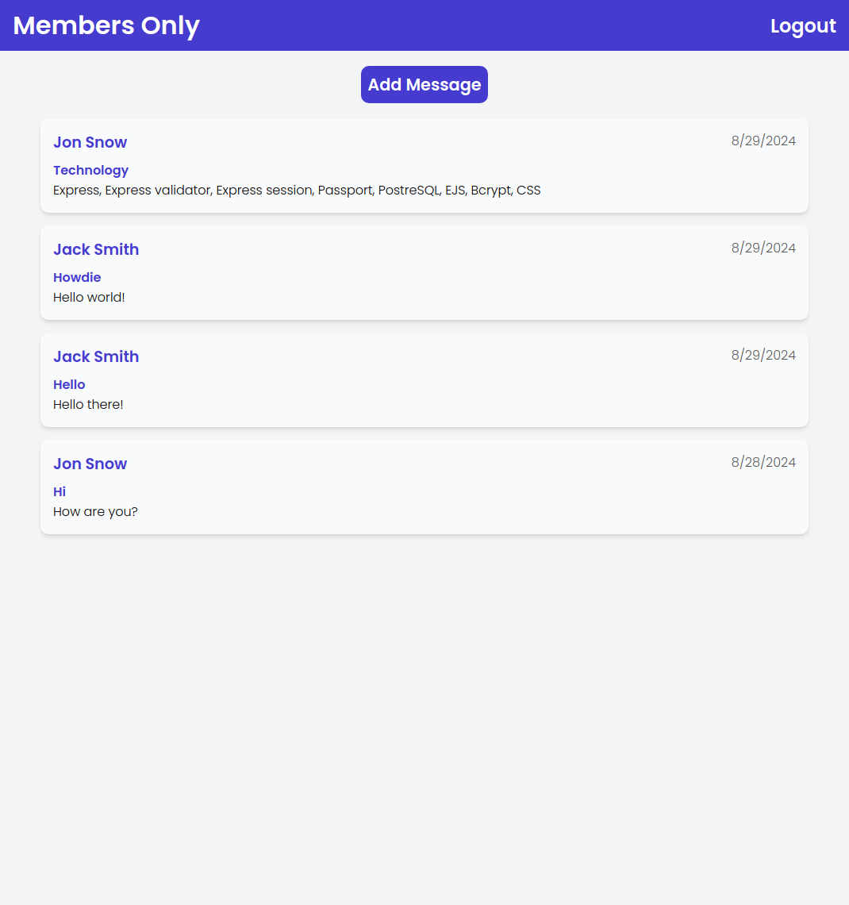
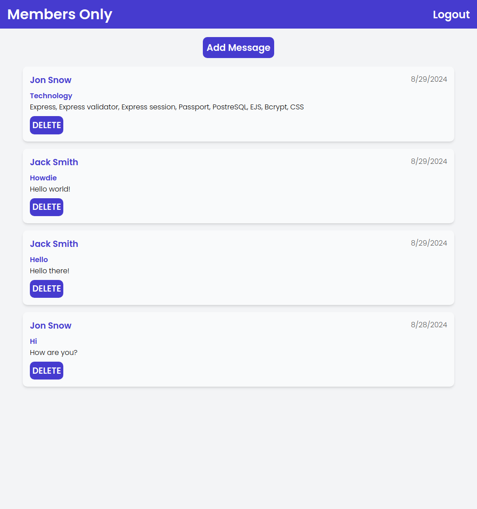
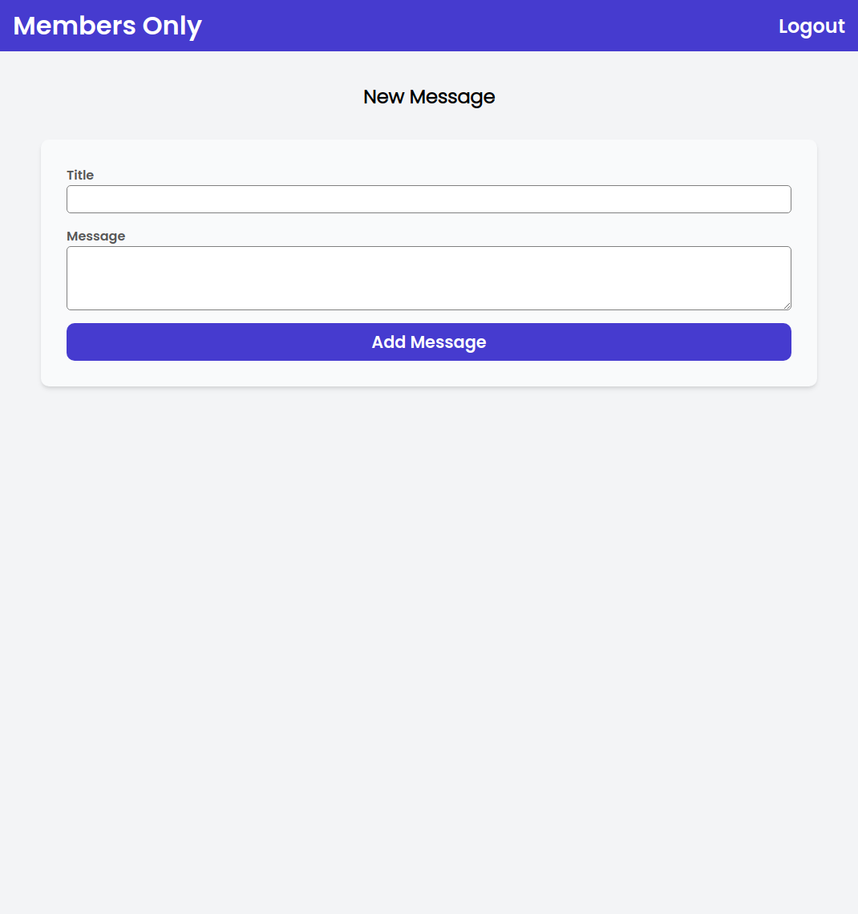
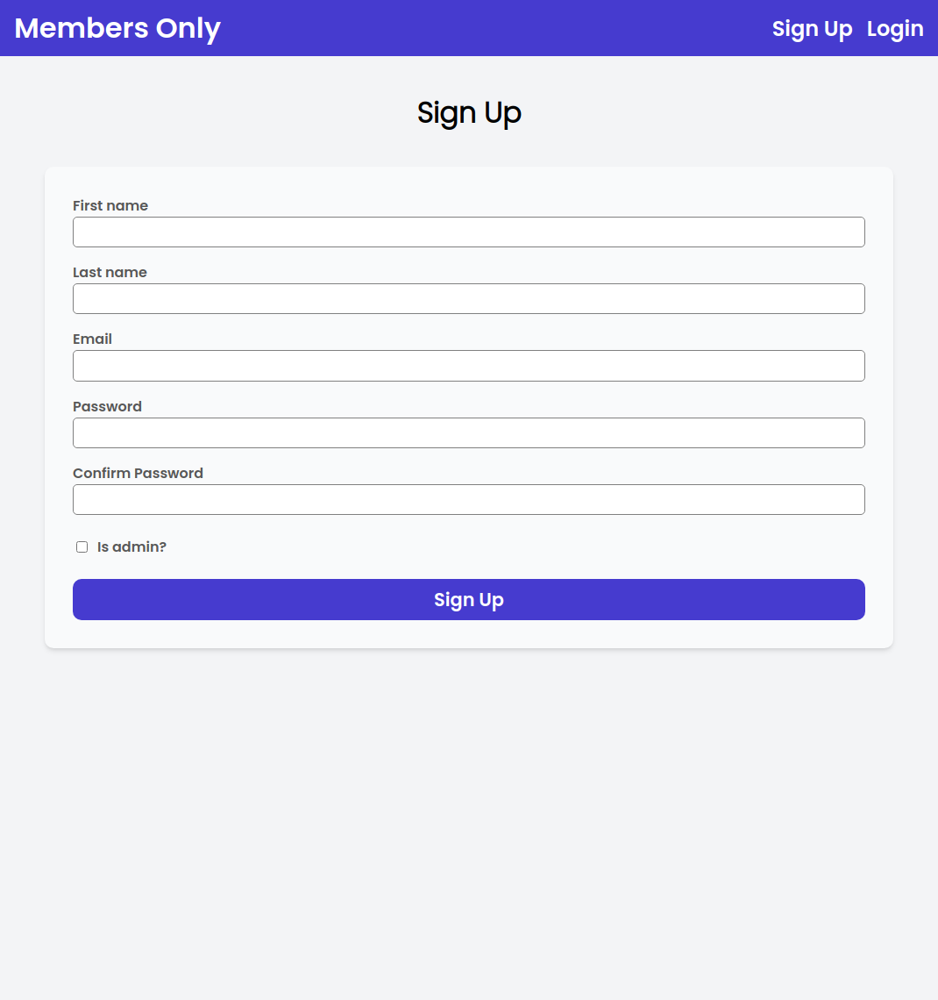
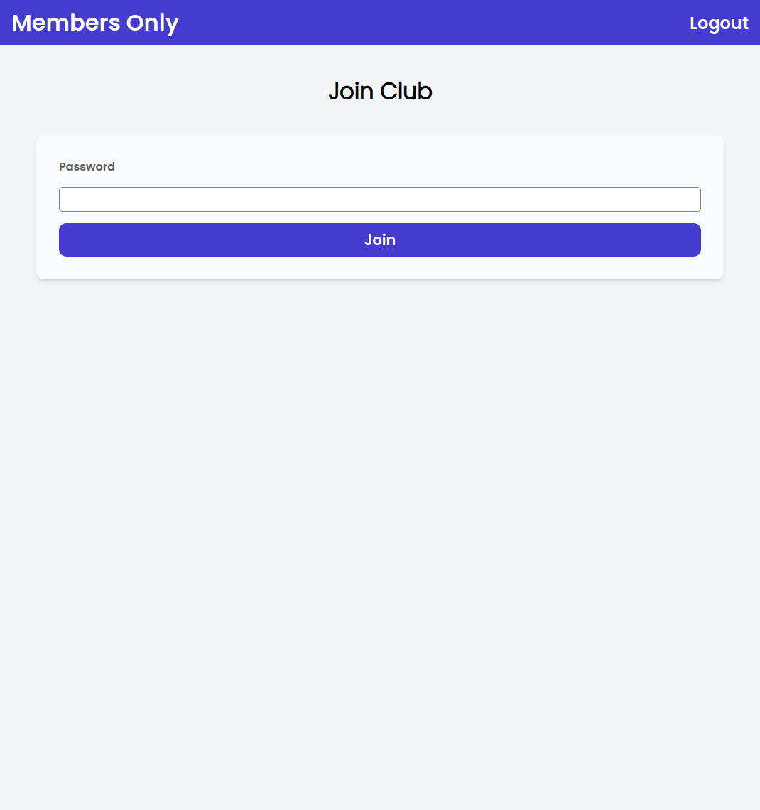
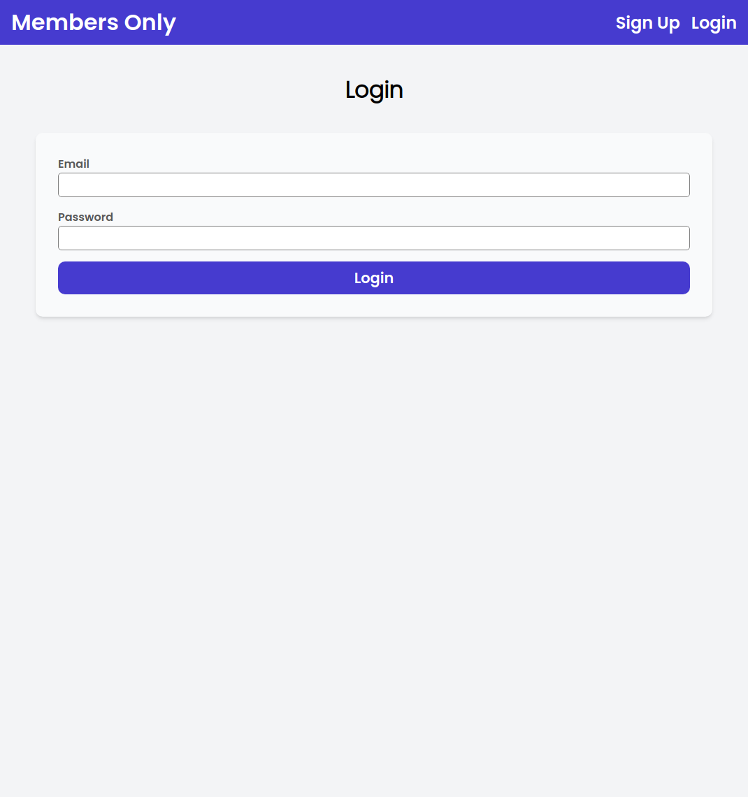
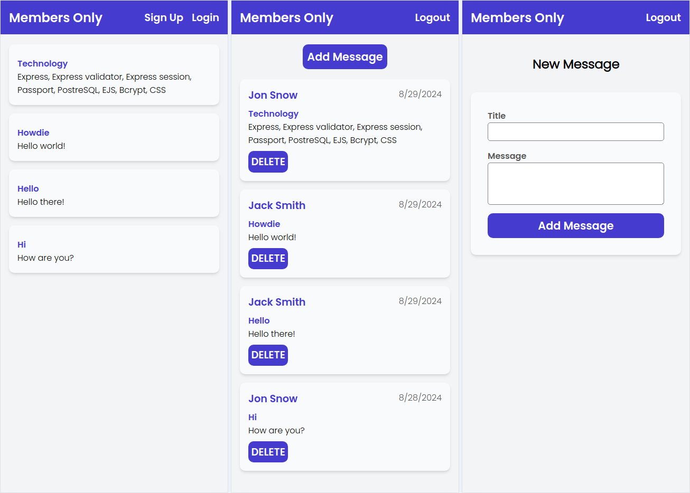
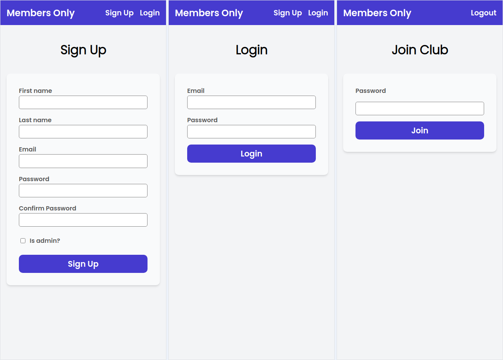

# Odin Project #25: Members Only

The goal of this full stack Odin Project assignment was to create a clubhouse where members can write anonymous posts. Only members can see the author and date of a post. Those outside  can only see the story and wonder who wrote it. After signing up the users must enter a secret passcode (currently stored in the .env) to become a member. Admin has permission to delete posts.

The database has two tables: users and messages. Authentication and sessions were the focus of this assignment and were implemented with passport, express session and bcrypt. 

I started and finished this project in August 2024.

## Assignment

[The Odin Project - NodeJS - #25 Members Only](https://www.theodinproject.com/lessons/node-path-nodejs-members-only)

## Technology

- JavaScript
- Node.js
- Express
- Express validator
- Express session
- Passport
- PostgreSQL
- EJS
- Bcrypt
- CSS

## Key Concepts

- MVC: Model View Controller pattern
- Express: setting up an app, middleware functions
- Routes: Express Router, HTTP verbs, paths
- Controllers: response methods, middleware, CRUD operations in the database
- Views: EJS configuration, using JS inside templates, sharing components across templates, rendering a view in a controller callback, serving static assets
- PostgreSQL: instalation, setting up a db, using node-postgres in Express (client & pool), database queries
- Express validator: form data validation: body() function & validationResult
- Error handling: error middleware function, custom errors; express-async-handler: catching thrown errors 
- Authentication:
* HTTP Headers & Cookies
* express-session library: session vs cookie, express session module, session store implementation: connect-pg-simple
* passport: local strategy, verifyCallback function, passport.authenticate() middleware, req.session object, serialize and deserialize functions, req.logout() & req.isAuthenticated() middleware
* bcrypt: bcrypt.hash: hashing passwords, bcrypt.compare(): compares plain-text password to the hashed password

## Screenshots

### Desktop

#### Guest



#### Member



#### Admin



#### All










### Mobile





## Sources

- https://fonts.google.com/specimen/Poppins

## Deployment

Requires setting up a PostreSQL database and adding its URL to the .env file. Instructions for Linux and macOS can be found [here on The Odin Project website](https://www.theodinproject.com/lessons/nodejs-installing-postgresql).

```bash
# clone repo
git clone https://github.com/BrightNeon7631/odin-members-only.git

# install project dependencies
npm install

# add session table to the the db
psql database_name < node_modules/connect-pg-simple/table.sql

# add default data to the db
npm run seed

# start server
node app.js
```